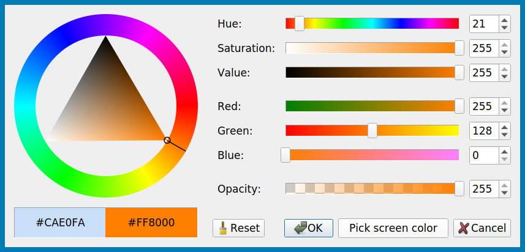

# pyqtcolordialog

A drop-in replacement of `QColorDialog` for `PyQt5`.

For comparison, here's the default Qt color picker:

## Video preview

Ring mode (default):

Square mode:

## Installation

`pip install pyqtcolordialog --user`
